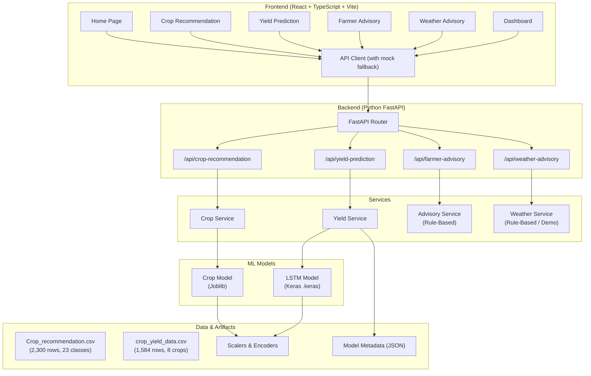
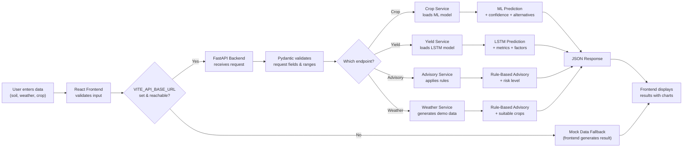

# Smart Crop Advisory and Recommendation System

**A Deep Learning Mini Project**

---

| | |
|---|---|
| **Student Name** | Aryan Srivastava |
| **USN** | 1CR23CI010 |
| **College** | CMR Institute of Technology, Bangalore |
| **Department** | Computer Science and Engineering — Artificial Intelligence and Machine Learning |
| **Project Type** | Deep Learning Mini Project |
| **Project Title** | Smart Crop Advisory and Recommendation System |

---

## Table of Contents

1. [Project Overview](#1-project-overview)
2. [Problem Statement](#2-problem-statement)
3. [Objectives](#3-objectives)
4. [Key Features](#4-key-features)
5. [Machine Learning vs Deep Learning vs Rule-Based Components](#5-machine-learning-vs-deep-learning-vs-rule-based-components)
6. [System Architecture](#6-system-architecture)
7. [Technology Stack](#7-technology-stack)
8. [Complete System Workflow](#8-complete-system-workflow)
9. [Crop Recommendation (Machine Learning)](#9-crop-recommendation-machine-learning)
10. [Yield Prediction (Deep Learning — LSTM)](#10-yield-prediction-deep-learning--lstm)
11. [ML Baseline Comparison](#11-ml-baseline-comparison)
12. [Dataset Details](#12-dataset-details)
13. [Data Preprocessing](#13-data-preprocessing)
14. [Data Leakage Prevention](#14-data-leakage-prevention)
15. [Exploratory Data Analysis](#15-exploratory-data-analysis)
16. [Training / Validation Curves](#16-training--validation-curves)
17. [Overfitting Analysis](#17-overfitting-analysis)
18. [Hyperparameter Tuning](#18-hyperparameter-tuning)
19. [Farmer Advisory (Rule-Based)](#19-farmer-advisory-rule-based)
20. [Weather Advisory (Rule-Based / Demo)](#20-weather-advisory-rule-based--demo)
21. [Dashboard](#21-dashboard)
22. [Frontend Pages](#22-frontend-pages)
23. [Backend / API Documentation](#23-backend--api-documentation)
24. [Project Folder Structure](#24-project-folder-structure)
25. [Installation and Setup](#25-installation-and-setup)
26. [How to Run the Project](#26-how-to-run-the-project)
27. [Testing](#27-testing)
28. [Model Performance Summary](#28-model-performance-summary)
29. [Limitations](#29-limitations)
30. [Future Enhancements](#30-future-enhancements)
31. [Conclusion](#31-conclusion)
32. [Author Information](#32-author-information)
33. [Final Project Summary Table](#33-final-project-summary-table)

---

## 1. Project Overview

The **Smart Crop Advisory and Recommendation System** is an intelligent agricultural platform that combines Machine Learning, Deep Learning, and rule-based reasoning to help farmers make better crop-related decisions. The system provides four core capabilities:

- **Crop Recommendation** — Suggests the most suitable crop based on soil nutrients (NPK), pH, temperature, humidity, and rainfall using a trained ML classification model.
- **Yield Prediction** — Predicts expected crop yield (tonnes/hectare) based on crop type, area, environmental conditions, fertilizer usage, and season using a trained LSTM deep learning model.
- **Farmer Advisory** — Generates personalized crop care advisories (irrigation, pest management, fertilization, soil health) using a rule-based expert system.
- **Weather Advisory** — Produces agricultural advisories and suitable crop suggestions based on sample/demo weather data using rule-based thresholds.

The project includes a full-stack implementation with a React + TypeScript frontend and a Python FastAPI backend, along with complete ML/DL training pipelines, exploratory data analysis, baseline model comparison, hyperparameter tuning, and overfitting analysis.

---

## 2. Problem Statement

Farmers face complex decisions when selecting crops, estimating yields, and managing day-to-day crop care. These decisions depend on multiple interrelated factors: soil composition (NPK, pH), weather conditions (temperature, humidity, rainfall), fertilizer usage, and seasonal context. Traditional farming relies heavily on generational experience, which may not account for changing environmental patterns or optimize for productivity.

This project addresses three core problems:

1. **Which crop should I plant?** — Given soil and environmental conditions, recommend the best crop with quantified confidence and alternative options.
2. **How much yield can I expect?** — Given crop choice, land area, weather, fertilizer, and season, predict the expected yield with model validation metrics.
3. **How should I care for my crop?** — Given crop type, soil condition, and current weather, generate actionable advisories for irrigation, pest control, and fertilization.

---

## 3. Objectives

1. Build a **Machine Learning** crop recommendation system using classification on the Crop Recommendation Dataset (23 crop classes, 7 features).
2. Build a **Deep Learning** yield prediction model using an **LSTM (Long Short-Term Memory)** recurrent neural network trained on a crop yield dataset.
3. Implement a **rule-based** farmer advisory system using crop-specific optimal condition tables and threshold-based rules.
4. Implement a **rule-based** weather advisory system using sample/demo weather data with clear labeling as demo mode.
5. Perform **Exploratory Data Analysis (EDA)** on both datasets with visualizations.
6. Train and compare **ML baseline models** (Linear Regression, Random Forest, Gradient Boosting) against the LSTM deep learning model.
7. Perform **hyperparameter tuning** for the LSTM model with a grid of learning rates, dropout rates, and LSTM unit configurations.
8. Generate **training/validation curves** and perform **overfitting analysis** with generalization gap computation.
9. Build a **full-stack web application** with a React frontend and FastAPI backend for end-to-end user interaction.
10. Provide a **unified dashboard** for visualizing all system outputs in one place.

---

## 4. Key Features

| Feature | Technique | Description |
|---------|-----------|-------------|
| Crop Recommendation | Machine Learning (Classification) | Recommends best crop with confidence score, key factor analysis, and alternative crops |
| Yield Prediction | Deep Learning (LSTM) | Predicts crop yield with model validation metrics (R², MAE, RMSE) and yearly comparison |
| Farmer Advisory | Rule-Based | Generates 5 categories of advisories: growing conditions, soil management, irrigation, pest control, fertilization |
| Weather Advisory | Rule-Based (Demo Data) | Generates weather advisories and suitable crop suggestions from sample weather data |
| Dashboard | Frontend Visualization | Consolidated overview with summary cards, yield trend chart, soil nutrient chart, and quick actions |
| EDA | Data Analysis | 9 visualizations across both datasets (distributions, correlations, boxplots, pairplots) |
| Baseline Comparison | ML vs DL | 3 ML baselines compared with the LSTM model on the same test set |
| Hyperparameter Tuning | Grid Search | 6 LSTM configurations tested with validation loss selection |
| Overfitting Analysis | Statistical Analysis | Training vs validation gap analysis with generalization gap metric |
| Mock Data Fallback | Frontend | Frontend gracefully falls back to mock data when backend is unreachable |

---

## 5. Machine Learning vs Deep Learning vs Rule-Based Components

It is important to clearly distinguish which parts of the system use each technique:

| Component | Technique | Model / Approach | Verified From |
|-----------|-----------|-----------------|---------------|
| Crop Recommendation | **Machine Learning** | Classification (RandomForest / LogisticRegression, best selected) | `train_crop_model.py`, `crop_service.py` |
| Yield Prediction | **Deep Learning — LSTM** | LSTM (64→32) recurrent neural network via TensorFlow/Keras | `train_yield_model.py`, `yield_service.py` |
| Farmer Advisory | **Rule-Based** | Crop-specific optimal condition tables + threshold rules | `advisory_service.py` |
| Weather Advisory | **Rule-Based / Demo** | Threshold rules on sample/demo weather data | `weather_service.py` |
| Dashboard | **Frontend Visualization** | Static/demo display values with Recharts visualizations | `Dashboard.tsx` |
| Frontend | **UI / React** | React + TypeScript + Tailwind CSS + Framer Motion | `src/` directory |
| Backend | **API / FastAPI** | Python FastAPI with Pydantic validation | `main.py`, `routes/` |

> **Note:** The Farmer Advisory and Weather Advisory systems are **not** ML or DL models. They use deterministic, rule-based logic with agricultural domain knowledge. The Weather Advisory uses **sample/demo data** and is clearly labeled as "Sample Data (Demo Mode)" — it does **not** connect to a live weather API.

---

## 6. System Architecture



### Architecture Summary

| Layer | Technology | Role |
|-------|-----------|------|
| Frontend | React 18, TypeScript, Vite 5, Tailwind CSS 3 | User interface, form validation, result visualization |
| API Layer | FastAPI, Pydantic | Request validation, response modeling, CORS handling |
| Service Layer | Python modules | Business logic, model loading, inference orchestration |
| Model Layer | scikit-learn, TensorFlow/Keras | Trained ML and DL models for prediction |
| Data Layer | CSV datasets, Joblib artifacts, Keras model files | Training data, saved models, preprocessing objects |

---

## 7. Technology Stack

| Layer | Technology | Version |
|-------|-----------|---------|
| **Frontend Framework** | React | 18.3.1 |
| **Frontend Language** | TypeScript | 5.6.2 |
| **Build Tool** | Vite | 5.4.8 |
| **Styling** | Tailwind CSS | 3.4.13 |
| **Charts** | Recharts | 2.12.7 |
| **Animations** | Framer Motion | 11.5.4 |
| **Icons** | lucide-react | 0.453.0 |
| **Routing** | React Router DOM | 6.26.2 |
| **Backend Framework** | FastAPI | 0.115.0 |
| **ASGI Server** | Uvicorn | 0.32.0 |
| **ML Library** | scikit-learn | 1.5.2 |
| **DL Framework** | TensorFlow (CPU) | 2.21.0 |
| **Data Processing** | Pandas | 2.2.3 |
| **Numerical Computing** | NumPy | 2.1.2 |
| **Model Serialization** | Joblib | 1.4.2 |
| **Request Validation** | Pydantic | 2.10.0 |
| **Visualization (EDA)** | Matplotlib | 3.9.2 |
| **Statistical Visualization** | Seaborn | 0.13.2 |

---

## 8. Complete System Workflow



---

## 9. Crop Recommendation (Machine Learning)

### Overview

The Crop Recommendation system uses a **Machine Learning classification model** to recommend the best crop based on soil nutrients (NPK), pH, temperature, humidity, and rainfall.

### Dataset

| Property | Value |
|----------|-------|
| File | `backend/datasets/Crop_recommendation.csv` |
| Source | [Kaggle — Crop Recommendation Dataset](https://www.kaggle.com/datasets/atharvaingle/crop-recommendation-dataset) |
| Rows | 2,300 |
| Columns | 8 (7 features + 1 label) |
| Crop classes | 23 |
| Samples per class | 100 (balanced) |

**Features:**

| Feature | Type | Range in Dataset |
|---------|------|-----------------|
| N (Nitrogen) | Numeric | 0–140 |
| P (Phosphorus) | Numeric | 5–145 |
| K (Potassium) | Numeric | 5–205 |
| temperature | Numeric (°C) | ~8–44 |
| humidity | Numeric (%) | ~14–90 |
| ph | Numeric | ~3.5–10 |
| rainfall | Numeric (mm) | ~20–298 |

**Target:** `label` — crop name (rice, wheat, maize, cotton, banana, coffee, etc.)

**Crop Classes (23):** apple, banana, blackgram, chickpea, coconut, coffee, cotton, grapes, jute, kidneybeans, lentil, maize, mango, mothbeans, mungbean, muskmelon, orange, papaya, pigeonpeas, pomegranate, rice, watermelon, wheat

### Training Methodology

The training script (`backend/training/train_crop_model.py`) trains **two classification algorithms** and saves the best-performing one:

| Model | Configuration |
|-------|--------------|
| Random Forest Classifier | `n_estimators=100, max_depth=15, random_state=42, n_jobs=-1` |
| Logistic Regression | `max_iter=1000, random_state=42` (with StandardScaler) |

**Selection criteria:** The model with the higher accuracy on the test set is saved.

**Train/test split:** 80/20, `stratify=y`, `random_state=42`

**Preprocessing:**
- Features are split into train/test **before** fitting the scaler
- `StandardScaler` is fit on training data only and applied to both train and test
- Random Forest is scale-invariant (uses unscaled features)
- Logistic Regression uses scaled features

### Saved Model

| Property | Value |
|----------|-------|
| Saved model file | `backend/ml_models/crop_model.joblib` |
| Scaler file | `backend/ml_models/crop_scaler.joblib` |
| Metadata file | `backend/ml_models/crop_metadata.joblib` |
| Best model selected | Determined by training script (higher accuracy wins) |
| Metadata fields | `model_name`, `accuracy`, `features`, `classes`, `needs_scaling` |

### Inference

The crop service (`backend/services/crop_service.py`):

1. Loads the saved model, scaler, and metadata (lazy-loaded on first request)
2. Builds a feature array: `[N, P, K, temperature, humidity, ph, rainfall]`
3. Applies `StandardScaler` transform if `needs_scaling=True` in metadata
4. Calls `model.predict()` for the crop recommendation
5. Calls `model.predict_proba()` for confidence and alternative crops
6. Returns the predicted crop, confidence percentage, and probability map for all classes

### API Response

The API returns:
- **crop** — recommended crop name
- **confidence** — probability percentage of the recommended crop
- **keyFactors** — analysis of temperature, rainfall, pH, and humidity impact
- **explanation** — natural language explanation of the recommendation
- **alternatives** — top 3 alternative crops with suitability scores

---

## 10. Yield Prediction (Deep Learning — LSTM)

### Overview

The Yield Prediction system uses a **Long Short-Term Memory (LSTM)** recurrent neural network — a type of Deep Learning architecture — to predict crop yield based on crop type, area, rainfall, temperature, humidity, fertilizer usage, and season.

### Final LSTM Architecture

The model is defined in `backend/training/train_yield_model.py`:

| Layer | Type | Configuration |
|-------|------|--------------|
| Input | `keras.layers.Input` | Shape: `(1, 16)` — 1 timestep, 16 features |
| LSTM 1 | `keras.layers.LSTM` | 64 units, `return_sequences=True` |
| Dropout 1 | `keras.layers.Dropout` | Rate: 0.15 |
| LSTM 2 | `keras.layers.LSTM` | 32 units, `return_sequences=False` |
| Dropout 2 | `keras.layers.Dropout` | Rate: 0.10 |
| Dense 1 | `keras.layers.Dense` | 16 units, ReLU activation |
| Output | `keras.layers.Dense` | 1 unit, linear activation (regression) |

### Input Shape Explanation

The tabular yield data has no natural temporal sequence. Each sample is treated as a **single-timestep sequence** — the 16 features are reshaped to `(batch_size, 1, 16)` before being fed into the LSTM layers. This satisfies the academic requirement of using an LSTM (a type of RNN) while working with the existing tabular dataset.

### Training Configuration

| Parameter | Value |
|-----------|-------|
| Optimizer | Adam |
| Learning rate | 0.001 |
| Loss function | MSE (Mean Squared Error) |
| Metrics | MAE (Mean Absolute Error) |
| Epochs | 80 (max) |
| Batch size | 32 |
| Validation split | 0.15 (15% of training set) |
| Early stopping | `patience=10`, `restore_best_weights=True`, monitor `val_loss` |
| Learning rate scheduler | `ReduceLROnPlateau` — `factor=0.5, patience=5, min_lr=1e-6` |

### Feature Engineering

**Numerical features (5):** area, rainfall, temperature, humidity, fertilizer
- Preprocessed with `StandardScaler` (fit on training data only)

**Categorical features (2):** crop, season
- Preprocessed with `OneHotEncoder` (`sparse_output=False`, `handle_unknown='ignore'`)
- Crop → 8 one-hot columns: crop_Cotton, crop_Maize, crop_Pulses, crop_Rice, crop_Soybean, crop_Sugarcane, crop_Tea, crop_Wheat
- Season → 3 one-hot columns: season_Kharif, season_Rabi, season_Zaid

**Total features after encoding: 16** (5 numerical + 8 crop + 3 season)

### Saved Artifacts

| File | Description |
|------|-------------|
| `backend/ml_models/yield_model.keras` | Trained LSTM Keras model |
| `backend/ml_models/yield_scaler.joblib` | StandardScaler for numerical features |
| `backend/ml_models/yield_encoder.joblib` | OneHotEncoder for categorical features |
| `backend/ml_models/yield_metadata.json` | Feature names, categorical columns, metrics, feature count |

### Actual Model Evaluation Metrics

Verified from `backend/ml_models/yield_metadata.json`:

| Metric | Value |
|--------|-------|
| **MAE** (Mean Absolute Error) | **0.9913** |
| **RMSE** (Root Mean Squared Error) | **2.2534** |
| **R²** (Coefficient of Determination) | **0.9864** |

> These metrics reflect actual test set performance. The API reads them from `yield_metadata.json` and returns them to the frontend as model reliability indicators.

### Inference Flow

The yield service (`backend/services/yield_service.py`):

1. Lazy-loads the Keras model, scaler, encoder, and metadata on first request
2. Builds numerical feature array: `[area, rainfall, temperature, humidity, fertilizer]`
3. Applies `StandardScaler.transform()` on numerical features
4. Builds a DataFrame with crop and season, applies `OneHotEncoder.transform()`
5. Combines numerical + categorical features (16 total)
6. Reshapes to `(1, 1, 16)` for LSTM input
7. Calls `model.predict()` and flattens the result
8. Clamps prediction to minimum 0.0
9. Returns predicted yield (rounded to 2 decimals) and unit

### API Response

The API returns:
- **predictedYield** — predicted yield in tonnes/hectare
- **unit** — "tonnes/hectare"
- **confidence** — R² score × 100 (model validation-based, not fabricated)
- **modelMetrics** — `{r2, mae, rmse}` read from metadata file
- **explanation** — natural language summary of the prediction
- **factors** — status analysis for rainfall, temperature, fertilizer, humidity
- **yearlyComparison** — historical context (2021–2024) derived from the prediction

---

## 11. ML Baseline Comparison

Three ML baseline models were trained on the **same yield dataset** and **same train/test split** as the LSTM model, then compared on the same test set.

### Baseline Models

| Model | Configuration |
|-------|--------------|
| Linear Regression | Default scikit-learn parameters |
| Random Forest Regressor | `n_estimators=100, max_depth=15, random_state=42, n_jobs=-1` |
| Gradient Boosting Regressor | `n_estimators=100, max_depth=5, random_state=42` |

### Comparison Results

Verified from `backend/training/analysis/baseline_figures/comparison_results.json`:

| Model | MAE | RMSE | R² |
|-------|-----|------|-----|
| Linear Regression | 1.6288 | 3.7478 | 0.9622 |
| Random Forest | 0.8385 | 2.2756 | 0.9861 |
| Gradient Boosting | 0.6856 | 2.1024 | 0.9881 |
| **Deep Learning (LSTM)** | **0.9913** | **2.2534** | **0.9864** |

> **Observation:** Gradient Boosting achieves the lowest MAE (0.6856) and highest R² (0.9881) on this dataset. The LSTM model achieves competitive performance with R² = 0.9864, demonstrating that the deep learning approach is viable for this regression task. The LSTM was chosen to fulfill the academic requirement of using a deep learning recurrent architecture.

Script: `backend/training/analysis/baseline_comparison.py`
Output figure: `backend/training/analysis/baseline_figures/baseline_vs_dl_comparison.png`

---

## 12. Dataset Details

### Dataset 1: Crop Recommendation

| Property | Value |
|----------|-------|
| File | `backend/datasets/Crop_recommendation.csv` |
| Source | Kaggle — [Crop Recommendation Dataset](https://www.kaggle.com/datasets/atharvaingle/crop-recommendation-dataset) |
| Shape | 2,300 rows × 8 columns |
| Features | N, P, K, temperature, humidity, ph, rainfall |
| Target | label (crop name) |
| Classes | 23 crops |
| Balance | 100 samples per class (balanced) |
| Missing values | None |

### Dataset 2: Crop Yield

| Property | Value |
|----------|-------|
| File | `backend/datasets/crop_yield_data.csv` |
| Source | Generated by `backend/training/generate_yield_dataset.py` |
| Shape | 1,584 rows × 8 columns |
| Features | crop, area, rainfall, temperature, humidity, fertilizer, season |
| Target | yield (tonnes/hectare) |
| Crops | 8 (Rice, Wheat, Maize, Cotton, Tea, Sugarcane, Pulses, Soybean) |
| Seasons | 3 (Kharif, Rabi, Zaid) |
| Samples per crop | 198 |
| Samples per season | 528 |
| Yield range | 0.38 – 84.57 |
| Yield mean | 8.47 |
| Yield std dev | 17.88 |
| Missing values | None |

**Yield Dataset Generation Methodology:**

The yield dataset is synthetically generated using documented average yields per crop from FAO and Indian agricultural statistics, combined with environmental modifiers:

- **Base yields (tonnes/hectare):** Rice=2.4, Wheat=3.1, Maize=5.5, Cotton=1.8, Tea=1.5, Sugarcane=70.0, Pulses=0.9, Soybean=1.6
- **Season multipliers:** Kharif=1.0, Rabi=0.95, Zaid=0.85
- **Environmental factors:** Each factor (rainfall, temperature, humidity, fertilizer) produces a multiplier based on proximity to ideal ranges
- **Ideal ranges:** Rainfall 120–250mm, Temperature 20–32°C, Humidity 50–80%, Fertilizer 50–150 kg/ha
- **Noise:** Gaussian noise (mean=1.0, std=0.05) added for realism
- **Random seed:** 123 (for reproducibility)

Script: `backend/training/generate_yield_dataset.py`

---

## 13. Data Preprocessing

### Crop Recommendation Preprocessing

| Step | Description |
|------|-------------|
| Feature extraction | `X = [N, P, K, temperature, humidity, ph, rainfall]` |
| Label extraction | `y = label` (crop name) |
| Train/test split | 80/20, `stratify=y`, `random_state=42` |
| Scaling | `StandardScaler` fit on training data, applied to both train and test |
| Encoding | Not needed — labels are string class names handled by the classifier |

### Yield Prediction Preprocessing

| Step | Description |
|------|-------------|
| Feature extraction | `X = [area, rainfall, temperature, humidity, fertilizer, crop, season]` |
| Target extraction | `y = yield` (numeric) |
| Train/test split | 80/20, `random_state=42` (no stratification — regression task) |
| Numerical scaling | `StandardScaler` fit on training numerical features only |
| Categorical encoding | `OneHotEncoder` fit on training categorical features only |
| Feature combination | `np.hstack([numerical_scaled, categorical_encoded])` → 16 features |
| LSTM reshaping | Reshaped to `(samples, 1, 16)` for LSTM input |

### Preprocessing Artifacts

| Artifact | File | Used By |
|----------|------|---------|
| Crop scaler | `crop_scaler.joblib` | `crop_service.py` |
| Crop metadata | `crop_metadata.joblib` | `crop_service.py` |
| Yield scaler | `yield_scaler.joblib` | `yield_service.py` |
| Yield encoder | `yield_encoder.joblib` | `yield_service.py` |
| Yield metadata | `yield_metadata.json` | `yield_service.py`, `yield_router.py` |

---

## 14. Data Leakage Prevention

Both training pipelines follow strict data leakage prevention:

1. **Split first, then fit preprocessors** — The raw data is split into train/test **before** any scaler or encoder is fit. This ensures no information from the test set leaks into preprocessing statistics.

2. **Fit on training data only** — `StandardScaler.fit_transform()` is called only on training features. The test set is transformed with `scaler.transform()` using the training-fitted parameters.

3. **Same for OneHotEncoder** — `OneHotEncoder.fit_transform()` is called only on training categorical features. Test categorical features are transformed with the training-fitted encoder.

4. **Consistent random state** — Both pipelines use `random_state=42` for `train_test_split`, ensuring reproducible splits.

5. **No stratification for regression** — The yield dataset uses a plain split (no `stratify` parameter) since stratification is not applicable to continuous regression targets.

This approach is consistent across:
- `train_yield_model.py`
- `training_curves.py`
- `hyperparameter_tuning.py`
- `baseline_comparison.py`

---

## 15. Exploratory Data Analysis

A comprehensive EDA was performed on both datasets using `backend/training/analysis/eda_analysis.py`, generating 9 visualizations.

### Crop Recommendation Dataset EDA

| Visualization | File | Description |
|--------------|------|-------------|
| Feature Distributions | `eda_figures/crop_feature_distributions.png` | Histograms of N, P, K, temperature, humidity, ph, rainfall |
| Correlation Heatmap | `eda_figures/crop_correlation_heatmap.png` | Pearson correlation between numeric features |
| Class Distribution | `eda_figures/crop_class_distribution.png` | Bar chart of samples per crop class |
| Feature Boxplots | `eda_figures/crop_boxplots.png` | Boxplots of features by crop (top 6 crops) |

### Yield Dataset EDA

| Visualization | File | Description |
|--------------|------|-------------|
| Feature Distributions | `eda_figures/yield_feature_distributions.png` | Histograms of area, rainfall, temperature, humidity, fertilizer, yield |
| Correlation Heatmap | `eda_figures/yield_correlation_heatmap.png` | Pearson correlation between numeric features |
| Yield by Crop | `eda_figures/yield_by_crop.png` | Boxplot of yield distribution for each crop |
| Yield by Season | `eda_figures/yield_by_season.png` | Boxplot of yield distribution for each season |
| Pairplot | `eda_figures/yield_pairplot.png` | Pairwise scatter plots colored by crop |

### EDA Console Output

The EDA script also prints to console:
- Dataset shape, first 5 rows
- Missing values per column
- Descriptive statistics
- Class/crop/season distributions

Script: `backend/training/analysis/eda_analysis.py`
Output directory: `backend/training/analysis/eda_figures/`

---

## 16. Training / Validation Curves

The training curves script retrains the LSTM with the same architecture and logs training/validation metrics per epoch.

### Generated Plots

| Plot | File | Description |
|------|------|-------------|
| Loss Curves | `training_figures/training_validation_loss.png` | Training vs validation MSE over epochs |
| MAE Curves | `training_figures/training_validation_mae.png` | Training vs validation MAE over epochs |

The plots use:
- Green solid line for training metrics
- Amber dashed line for validation metrics
- Grid for readability

Script: `backend/training/analysis/training_curves.py`

---

## 17. Overfitting Analysis

### Results

Verified from `backend/training/analysis/training_figures/overfitting_analysis.json`:

| Metric | Value |
|--------|-------|
| Final Training Loss (MSE) | 6.7497 |
| Final Validation Loss (MSE) | 1.6078 |
| Final Training MAE | 1.1326 |
| Final Validation MAE | 0.6515 |
| Generalization Gap | 5.1419 |
| Test MAE | 0.9967 |
| Test RMSE | 2.2455 |
| Test R² | 0.9864 |

### Interpretation

The generalization gap of 5.1419 is relatively large, which is expected for a neural network on a small dataset (1,584 samples). The training loss is higher than the validation loss, which can occur when dropout layers are active during training but disabled during validation. Despite this gap, the test R² of 0.9864 indicates the model generalizes well to unseen data.

The model uses Dropout (0.15 and 0.10) and EarlyStopping (patience=10) to mitigate overfitting.

Script: `backend/training/analysis/training_curves.py`
Output: `backend/training/analysis/training_figures/overfitting_analysis.json`

---

## 18. Hyperparameter Tuning

A lightweight grid search was performed testing 6 LSTM configurations.

### Hyperparameter Grid

| Parameter | Values Tested |
|-----------|--------------|
| Learning rate | 0.001, 0.0005 |
| Dropout rate | 0.10, 0.15, 0.20 |
| LSTM units | (64, 32), (32, 16) |

### All Configurations Tested

Verified from `backend/training/analysis/tuning_figures/tuning_results.json`:

| Config | Learning Rate | Dropout | LSTM Units | Val Loss | Val MAE | Test R² | Test MAE | Epochs |
|--------|--------------|---------|------------|----------|---------|---------|----------|--------|
| 1 | 0.001 | 0.10 | (64, 32) | 4.7016 | 0.9134 | 0.9767 | 1.2310 | 50 |
| 2 | 0.001 | 0.20 | (64, 32) | 7.4662 | 1.0378 | 0.9710 | 1.2988 | 50 |
| 3 | 0.0005 | 0.10 | (64, 32) | 9.5057 | 1.1109 | 0.9640 | 1.4169 | 50 |
| 4 | 0.0005 | 0.20 | (64, 32) | 11.1494 | 1.1884 | 0.9613 | 1.4180 | 50 |
| 5 | 0.001 | 0.15 | (32, 16) | 9.5454 | 1.1236 | 0.9654 | 1.3669 | 50 |
| 6 | 0.0005 | 0.15 | (32, 16) | 11.0024 | 1.2723 | 0.9623 | 1.4614 | 50 |

### Best Configuration

| Property | Value |
|----------|-------|
| Config | #1 |
| Learning rate | 0.001 |
| Dropout | 0.10 |
| LSTM units | (64, 32) |
| Val Loss | 4.7016 |
| Val MAE | 0.9134 |
| Test R² | 0.9767 |
| Selection metric | Val Loss (lower is better) |

> **Note:** The final production model (`yield_model.keras`) uses the architecture from `train_yield_model.py` (dropout 0.15/0.10, lr=0.001, LSTM units 64/32) with 80 max epochs and both EarlyStopping + ReduceLROnPlateau callbacks. The tuning script uses 50 epochs with only EarlyStopping for efficiency.

Script: `backend/training/analysis/hyperparameter_tuning.py`
Output: `backend/training/analysis/tuning_figures/tuning_results.json`

---

## 19. Farmer Advisory (Rule-Based)

### Overview

The Farmer Advisory is a **rule-based expert system** — it does **not** use Machine Learning or Deep Learning. It uses crop-specific optimal condition tables and threshold-based rules to generate agricultural advice.

### How It Works

1. **Crop optimal conditions** — A lookup table (`CROP_OPTIMAL`) stores ideal temperature, humidity, and rainfall ranges for 8 crops (Rice, Wheat, Maize, Cotton, Tea, Sugarcane, Pulses, Soybean). A `DEFAULT_OPTIMAL` fallback is used for unlisted crops.

2. **Risk assessment** — Classifies risk as Low/Moderate/High based on temperature and humidity thresholds:
   - High: temperature > 35°C or humidity > 90% or temperature < 5°C
   - Moderate: temperature > 30°C or humidity > 80%
   - Low: otherwise

3. **Advisory generation** — Produces 5 advisory categories:

| Category | Title | Logic |
|----------|-------|-------|
| Growing Conditions | Optimal Growing Environment | Compares current temperature against crop-specific optimal range |
| Soil Management | Soil Health Recommendations | Advice based on soil type (clay/sandy/loamy) and rainfall |
| Irrigation | Watering Schedule | Based on rainfall amount and humidity |
| Crop Care | Pest & Disease Management | Based on humidity level (fungal risk, spider mites) |
| Fertilization | Nutrient Management | General NPK advice with split application recommendation |

### Input Fields

| Field | Type | Validation |
|-------|------|-----------|
| crop | string | Required |
| soilCondition | string | Required |
| temperature | float | -10 to 50 |
| humidity | float | 0 to 100 |
| rainfall | float | 0 to 500 |

### Response Fields

| Field | Description |
|-------|-------------|
| crop | Crop name |
| riskLevel | "Low", "Moderate", or "High" |
| summary | Natural language summary of conditions and risk |
| advisories | Array of 5 advisory items (category, title, advice, icon) |

Script: `backend/services/advisory_service.py`

---

## 20. Weather Advisory (Rule-Based / Demo)

### Overview

The Weather Advisory is a **rule-based system** that uses **sample/demo weather data** — it does **not** connect to a live weather API and does **not** use Machine Learning or Deep Learning.

### How It Works

1. **Sample data generation** — If no weather values are provided in the request, the system generates realistic random values:
   - Temperature: random 25.0–33.0°C
   - Humidity: random 55.0–85.0%
   - Rainfall: random 30.0–200.0 mm
   - Wind speed: random 5.0–25.0 km/h

2. **Condition determination** — Derives a weather condition string from the values:
   - Rainfall > 150: "Heavy Rain"
   - Rainfall > 100: "Light Rain"
   - Temperature > 32: "Sunny & Hot"
   - Humidity > 85: "Humid & Cloudy"
   - Temperature < 15: "Cool & Clear"
   - Otherwise: "Partly Cloudy"

3. **Advisory generation** — Produces advisories based on thresholds:
   - Rainfall: heavy rain alert / low rainfall warning / adequate rainfall
   - Temperature: high temp warning / low temp notice / favorable
   - Humidity: high humidity notice / low humidity notice / balanced

4. **Suitable crops** — Suggests crops based on temperature:
   - > 28°C: Rice, Cotton, Sugarcane, Maize
   - < 22°C: Wheat, Tea, Peas, Mustard
   - Otherwise: Rice, Wheat, Maize, Pulses

### Demo Mode Labeling

The weather response includes `"location": "Sample Data (Demo Mode)"` to clearly indicate that the data is not from a live weather API. The frontend also displays this label.

Script: `backend/services/weather_service.py`

---

## 21. Dashboard

### Overview

The Dashboard provides a consolidated visual overview of all system capabilities in one page. It contains **static/demo display values** — the values shown are representative examples, not live model predictions fetched from the backend.

### Dashboard Sections

| Section | Content | Data Source |
|---------|---------|-------------|
| Summary Cards | Recommended Crop, Predicted Yield, Weather Summary, Soil Summary, Latest Advisory, Soil Type | Static/demo values hardcoded in component |
| Yield Trend Chart | Monthly predicted yield (area chart) | Static/demo data array in component |
| Soil Nutrient Levels | NPK values (radial bar chart) | Static/demo data array in component |
| Environmental Conditions | Temperature, Humidity, Rainfall cards | Static/demo values in component |
| Quick Actions | Navigation links to all feature pages | Route links |

> **Important:** The Dashboard values are **static/demo** — they are hardcoded in the `Dashboard.tsx` component for demonstration purposes. They are **not** fetched from the backend API or generated by the ML/DL models. The R² value shown (0.986) matches the LSTM model's actual validation R², but the yield value (2.4 t/ha) and other metrics are display examples.

---

## 22. Frontend Pages

### Routes

| Route | Page Component | Description |
|-------|---------------|-------------|
| `/` | `Home.tsx` | Landing page with hero, features, how-it-works, and technology sections |
| `/crop-recommendation` | `CropRecommendation.tsx` | Form for NPK/pH/weather input, displays recommended crop with confidence and alternatives |
| `/yield-prediction` | `YieldPrediction.tsx` | Form for crop/area/weather/fertilizer/season input, displays predicted yield with metrics and charts |
| `/farmer-advisory` | `FarmerAdvisory.tsx` | Form for crop/soil/weather input, displays 5 advisory categories with risk level |
| `/weather-advisory` | `WeatherAdvisory.tsx` | Displays sample weather data, advisories, and suitable crops |
| `/dashboard` | `Dashboard.tsx` | Consolidated overview with summary cards, charts, and quick actions |

### Frontend Architecture

| Component | File | Purpose |
|-----------|------|---------|
| App | `src/App.tsx` | Root component with routing |
| Navbar | `src/components/layout/Navbar.tsx` | Top navigation bar |
| Footer | `src/components/layout/Footer.tsx` | Footer |
| Logo | `src/components/layout/Logo.tsx` | App logo |
| ScrollToTop | `src/components/layout/ScrollToTop.tsx` | Scrolls to top on route change |
| PageHeader | `src/components/ui/PageHeader.tsx` | Consistent page header with icon |
| FormInput | `src/components/ui/FormInput.tsx` | Reusable form input with validation |
| LoadingSpinner | `src/components/ui/LoadingSpinner.tsx` | Loading indicator |
| ErrorMessage | `src/components/ui/ErrorMessage.tsx` | Error display |
| ResultCard | `src/components/ui/ResultCard.tsx` | Result display card |
| ConfidenceBar | `src/components/ui/ConfidenceBar.tsx` | Visual confidence indicator |
| FeatureCard | `src/components/ui/FeatureCard.tsx` | Home page feature card |

### API Client with Mock Fallback

The frontend API client (`src/services/apiClient.ts`) implements a graceful fallback mechanism:

1. If `VITE_API_BASE_URL` is set and the backend is reachable → sends request to FastAPI backend
2. If `VITE_API_BASE_URL` is not set → uses built-in mock data directly
3. If the backend is unreachable (network error or timeout) → falls back to mock data with a console warning

Each service module (`cropService.ts`, `yieldService.ts`, `advisoryService.ts`, `weatherService.ts`) contains a mock function that generates realistic sample responses for demonstration without a backend.

### Custom Hooks

| Hook | File | Purpose |
|------|------|---------|
| `useForm` | `src/hooks/useForm.ts` | Form state management with validation |
| `useAsync` | `src/hooks/useAsync.ts` | Async operation state (loading, error, data) |

---

## 23. Backend / API Documentation

### Server Configuration

| Property | Value |
|----------|-------|
| Framework | FastAPI 0.115.0 |
| Server | Uvicorn 0.32.0 |
| CORS | Allow all origins (`*`) |
| Allowed methods | GET, POST, PUT, DELETE, OPTIONS |
| Prefix | `/api` for all feature routes |

### Endpoints

#### GET `/` — Root

Returns service status and list of available endpoints.

**Response:**
```json
{
  "status": "online",
  "service": "Smart Crop Advisory API",
  "endpoints": [
    "/api/crop-recommendation",
    "/api/yield-prediction",
    "/api/farmer-advisory",
    "/api/weather-advisory"
  ]
}
```

#### GET `/health` — Health Check

**Response:**
```json
{
  "status": "healthy"
}
```

---

#### POST `/api/crop-recommendation` — Crop Recommendation

**Request:**

| Field | Type | Validation | Description |
|-------|------|-----------|-------------|
| nitrogen | float | 0–140 | Nitrogen level (kg/ha) |
| phosphorus | float | 0–145 | Phosphorus level (kg/ha) |
| potassium | float | 0–205 | Potassium level (kg/ha) |
| ph | float | 0–14 | Soil pH |
| temperature | float | -10 to 50 | Temperature (°C) |
| humidity | float | 0–100 | Humidity (%) |
| rainfall | float | 0–500 | Rainfall (mm) |

**Response:**

| Field | Type | Description |
|-------|------|-------------|
| crop | string | Recommended crop name |
| confidence | int | Confidence percentage (0–100) |
| keyFactors | array | Key factor analysis (factor, value, impact) |
| explanation | string | Natural language explanation |
| alternatives | array | Top 3 alternative crops (crop, suitability) |

**Example Request:**
```json
{
  "nitrogen": 90,
  "phosphorus": 42,
  "potassium": 43,
  "ph": 6.5,
  "temperature": 25,
  "humidity": 80,
  "rainfall": 200
}
```

---

#### POST `/api/yield-prediction` — Yield Prediction

**Request:**

| Field | Type | Validation | Description |
|-------|------|-----------|-------------|
| crop | string | Required | Crop name (Rice, Wheat, Maize, etc.) |
| area | float | > 0 | Land area (hectares) |
| rainfall | float | ≥ 0 | Rainfall (mm) |
| temperature | float | -10 to 50 | Temperature (°C) |
| humidity | float | 0–100 | Humidity (%) |
| fertilizer | float | ≥ 0 | Fertilizer usage (kg/ha) |
| season | string | Required | Season (Kharif, Rabi, Zaid) |

**Response:**

| Field | Type | Description |
|-------|------|-------------|
| crop | string | Crop name |
| predictedYield | float | Predicted yield (tonnes/hectare) |
| unit | string | "tonnes/hectare" |
| confidence | int | R² × 100 (model validation-based) |
| modelMetrics | object | `{r2, mae, rmse}` from model metadata |
| explanation | string | Natural language prediction explanation |
| factors | array | Factor status analysis (factor, status, detail) |
| yearlyComparison | array | Historical yield context (year, yield) |

**Example Request:**
```json
{
  "crop": "Rice",
  "area": 1.5,
  "rainfall": 200,
  "temperature": 25,
  "humidity": 80,
  "fertilizer": 150,
  "season": "Kharif"
}
```

---

#### POST `/api/farmer-advisory` — Farmer Advisory

**Request:**

| Field | Type | Validation | Description |
|-------|------|-----------|-------------|
| crop | string | Required | Crop name |
| soilCondition | string | Required | Soil type (Clay, Sandy, Loamy, etc.) |
| temperature | float | -10 to 50 | Temperature (°C) |
| humidity | float | 0–100 | Humidity (%) |
| rainfall | float | 0–500 | Rainfall (mm) |

**Response:**

| Field | Type | Description |
|-------|------|-------------|
| crop | string | Crop name |
| riskLevel | string | "Low", "Moderate", or "High" |
| summary | string | Advisory summary |
| advisories | array | 5 advisory items (category, title, advice, icon) |

---

#### POST `/api/weather-advisory` — Weather Advisory

**Request (all fields optional):**

| Field | Type | Validation | Description |
|-------|------|-----------|-------------|
| temperature | float | -10 to 50 | Temperature (°C) — if omitted, generated randomly |
| humidity | float | 0–100 | Humidity (%) — if omitted, generated randomly |
| rainfall | float | 0–500 | Rainfall (mm) — if omitted, generated randomly |
| condition | string | — | Weather condition — if omitted, derived from values |
| windSpeed | float | 0–200 | Wind speed (km/h) — if omitted, generated randomly |

**Response:**

| Field | Type | Description |
|-------|------|-------------|
| weather | object | Temperature, humidity, rainfall, condition, windSpeed, location |
| advisories | array | Weather-based advisories (title, advice, severity) |
| suitableCrops | array | List of crop names suitable for the temperature |

> The `location` field always returns `"Sample Data (Demo Mode)"` to clearly indicate demo data.

---

## 24. Project Folder Structure

```
smart-crop-advisory-system/
├── README.md
├── package.json
├── package-lock.json
├── vite.config.ts
├── tsconfig.json
├── tsconfig.node.json
├── tailwind.config.js
├── postcss.config.js
├── index.html
├── .env
├── public/
│   └── leaf.svg
├── src/
│   ├── App.tsx
│   ├── main.tsx
│   ├── index.css
│   ├── vite-env.d.ts
│   ├── components/
│   │   ├── layout/
│   │   │   ├── Navbar.tsx
│   │   │   ├── Footer.tsx
│   │   │   ├── Logo.tsx
│   │   │   └── ScrollToTop.tsx
│   │   └── ui/
│   │       ├── ConfidenceBar.tsx
│   │       ├── ErrorMessage.tsx
│   │       ├── FeatureCard.tsx
│   │       ├── FormInput.tsx
│   │       ├── LoadingSpinner.tsx
│   │       ├── PageHeader.tsx
│   │       └── ResultCard.tsx
│   ├── hooks/
│   │   ├── index.ts
│   │   ├── useAsync.ts
│   │   └── useForm.ts
│   ├── pages/
│   │   ├── Home.tsx
│   │   ├── CropRecommendation.tsx
│   │   ├── YieldPrediction.tsx
│   │   ├── FarmerAdvisory.tsx
│   │   ├── WeatherAdvisory.tsx
│   │   └── Dashboard.tsx
│   └── services/
│       ├── index.ts
│       ├── apiClient.ts
│       ├── types.ts
│       ├── cropService.ts
│       ├── yieldService.ts
│       ├── advisoryService.ts
│       └── weatherService.ts
└── backend/
    ├── main.py
    ├── requirements.txt
    ├── datasets/
    │   ├── Crop_recommendation.csv
    │   └── crop_yield_data.csv
    ├── ml_models/
    │   ├── crop_model.joblib
    │   ├── crop_scaler.joblib
    │   ├── crop_metadata.joblib
    │   ├── yield_model.keras
    │   ├── yield_scaler.joblib
    │   ├── yield_encoder.joblib
    │   └── yield_metadata.json
    ├── routes/
    │   ├── __init__.py
    │   ├── crop_router.py
    │   ├── yield_router.py
    │   ├── advisory_router.py
    │   └── weather_router.py
    ├── schemas/
    │   ├── __init__.py
    │   ├── crop_schemas.py
    │   ├── yield_schemas.py
    │   ├── advisory_schemas.py
    │   └── weather_schemas.py
    ├── services/
    │   ├── __init__.py
    │   ├── crop_service.py
    │   ├── yield_service.py
    │   ├── advisory_service.py
    │   └── weather_service.py
    └── training/
        ├── generate_crop_dataset.py
        ├── generate_yield_dataset.py
        ├── train_crop_model.py
        ├── train_yield_model.py
        └── analysis/
            ├── eda_analysis.py
            ├── baseline_comparison.py
            ├── training_curves.py
            ├── hyperparameter_tuning.py
            ├── eda_figures/
            │   ├── crop_feature_distributions.png
            │   ├── crop_correlation_heatmap.png
            │   ├── crop_class_distribution.png
            │   ├── crop_boxplots.png
            │   ├── yield_feature_distributions.png
            │   ├── yield_correlation_heatmap.png
            │   ├── yield_by_crop.png
            │   ├── yield_by_season.png
            │   └── yield_pairplot.png
            ├── baseline_figures/
            │   ├── baseline_vs_dl_comparison.png
            │   └── comparison_results.json
            ├── training_figures/
            │   ├── training_validation_loss.png
            │   ├── training_validation_mae.png
            │   └── overfitting_analysis.json
            └── tuning_figures/
                └── tuning_results.json
```

---

## 25. Installation and Setup

### Prerequisites

- **Python** 3.10+ (tested with Python 3.13)
- **Node.js** 18+ and npm
- **pip** (Python package manager)

### Backend Requirements

From `backend/requirements.txt`:

```
fastapi==0.115.0
uvicorn[standard]==0.32.0
scikit-learn==1.5.2
pandas==2.2.3
numpy==2.1.2
joblib==1.4.2
tensorflow-cpu==2.21.0
pydantic==2.10.0
matplotlib==3.9.2
seaborn==0.13.2
```

### Frontend Requirements

From `package.json`:

```
react: ^18.3.1
react-dom: ^18.3.1
react-router-dom: ^6.26.2
lucide-react: ^0.453.0
recharts: ^2.12.7
framer-motion: ^11.5.4
```

Dev dependencies:

```
typescript: ^5.6.2
vite: ^5.4.8
@vitejs/plugin-react: ^4.3.1
tailwindcss: ^3.4.13
autoprefixer: ^10.4.20
postcss: ^8.4.47
@types/react: ^18.3.8
@types/react-dom: ^18.3.0
```

---

## 26. How to Run the Project

### Step 1: Backend Setup

```bash
cd backend
pip install -r requirements.txt
```

### Step 2: Start the Backend Server

```bash
cd backend
uvicorn main:app --host 0.0.0.0 --port 8000
```

The backend will start at `http://localhost:8000`. Verify with:

```bash
curl http://localhost:8000/health
# Expected: {"status":"healthy"}
```

### Step 3: Frontend Setup

```bash
npm install
```

### Step 4: Configure Environment (Optional)

Create a `.env` file in the project root:

```env
VITE_API_BASE_URL=http://localhost:8000
```

> When `VITE_API_BASE_URL` is not set, the frontend uses built-in mock data with graceful fallback. This allows the frontend to be demonstrated independently without the backend.

### Step 5: Start the Frontend Development Server

```bash
npm run dev
```

The frontend will start at `http://localhost:5173`.

### Step 6: Build for Production

```bash
npm run build
```

This runs `tsc -b && vite build` and outputs to the `dist/` directory.

### Running Training Scripts (Optional)

The pre-trained models are already included in `backend/ml_models/`. To retrain from scratch:

```bash
# Crop Recommendation model
python backend/training/train_crop_model.py

# Yield Prediction LSTM model
python backend/training/train_yield_model.py

# EDA
python backend/training/analysis/eda_analysis.py

# Baseline comparison
python backend/training/analysis/baseline_comparison.py

# Training curves + overfitting analysis
python backend/training/analysis/training_curves.py

# Hyperparameter tuning
python backend/training/analysis/hyperparameter_tuning.py
```

---

## 27. Testing

### Build Verification

```bash
npm run build    # TypeScript compilation + Vite production build
```

### API Testing

All four API endpoints can be tested with curl:

**Crop Recommendation (valid input):**
```bash
curl -X POST http://localhost:8000/api/crop-recommendation \
  -H "Content-Type: application/json" \
  -d '{"nitrogen":90,"phosphorus":42,"potassium":43,"ph":6.5,"temperature":25,"humidity":80,"rainfall":200}'
```

**Crop Recommendation (invalid input — missing required field):**
```bash
curl -X POST http://localhost:8000/api/crop-recommendation \
  -H "Content-Type: application/json" \
  -d '{"nitrogen":90}'
# Expected: 422 Validation Error — "Field required"
```

**Yield Prediction (valid input):**
```bash
curl -X POST http://localhost:8000/api/yield-prediction \
  -H "Content-Type: application/json" \
  -d '{"crop":"Rice","area":1.5,"rainfall":200,"temperature":25,"humidity":80,"fertilizer":150,"season":"Kharif"}'
```

**Yield Prediction (invalid input — area ≤ 0):**
```bash
curl -X POST http://localhost:8000/api/yield-prediction \
  -H "Content-Type: application/json" \
  -d '{"crop":"Rice","area":-1,"rainfall":200,"temperature":25,"humidity":80,"fertilizer":150,"season":"Kharif"}'
# Expected: 422 Validation Error — "Input should be greater than 0"
```

**Farmer Advisory (valid input):**
```bash
curl -X POST http://localhost:8000/api/farmer-advisory \
  -H "Content-Type: application/json" \
  -d '{"crop":"Rice","soilCondition":"Loamy","temperature":28,"humidity":75,"rainfall":180}'
```

**Weather Advisory (no input — generates demo data):**
```bash
curl -X POST http://localhost:8000/api/weather-advisory \
  -H "Content-Type: application/json" \
  -d '{}'
```

### Validation Behavior

All API endpoints use **Pydantic models** for request validation. Invalid inputs (out-of-range values, missing fields, wrong types) are rejected with HTTP 422 and a descriptive error message before reaching the model/service layer.

---

## 28. Model Performance Summary

### LSTM Yield Prediction Model

| Metric | Value | Source |
|--------|-------|--------|
| MAE | 0.9913 | `yield_metadata.json` |
| RMSE | 2.2534 | `yield_metadata.json` |
| R² | 0.9864 | `yield_metadata.json` |

### Overfitting Analysis

| Metric | Value | Source |
|--------|-------|--------|
| Generalization Gap | 5.1419 | `overfitting_analysis.json` |
| Test R² | 0.9864 | `overfitting_analysis.json` |
| Test MAE | 0.9967 | `overfitting_analysis.json` |
| Test RMSE | 2.2455 | `overfitting_analysis.json` |

### Baseline Comparison

| Model | MAE | RMSE | R² |
|-------|-----|------|-----|
| Linear Regression | 1.6288 | 3.7478 | 0.9622 |
| Random Forest | 0.8385 | 2.2756 | 0.9861 |
| Gradient Boosting | 0.6856 | 2.1024 | 0.9881 |
| Deep Learning (LSTM) | 0.9913 | 2.2534 | 0.9864 |

### Hyperparameter Tuning — Best Config

| Property | Value |
|----------|-------|
| Config | #1 |
| Learning rate | 0.001 |
| Dropout | 0.10 |
| LSTM units | (64, 32) |
| Val Loss | 4.7016 |

---

## 29. Limitations

1. **Yield dataset is synthetic** — The crop yield dataset (1,584 rows) is generated programmatically using FAO/Indian agriculture base yields with environmental modifiers and random noise. It does not come from real-world field measurements. Model performance on real-world data may differ.

2. **Weather data is sample/demo** — The Weather Advisory does not connect to a live weather API. It generates random values within realistic ranges and is explicitly labeled as "Sample Data (Demo Mode)".

3. **Generalization gap** — The LSTM model shows a generalization gap of 5.1419 between training and validation loss, which is expected for a neural network on a relatively small dataset. Dropout and EarlyStopping are used to mitigate this.

4. **Dashboard values are static** — The Dashboard displays hardcoded demo values, not live model predictions. It serves as a visual showcase, not a real-time monitoring tool.

5. **LSTM on tabular data** — The LSTM processes tabular data as single-timestep sequences (reshaped to `(1, 16)`). While this satisfies the academic requirement of using an LSTM architecture, the data has no natural temporal sequence.

6. **Limited crop coverage** — The yield dataset covers 8 crops (Rice, Wheat, Maize, Cotton, Tea, Sugarcane, Pulses, Soybean), while the crop recommendation dataset covers 23 crops. The two systems operate on different crop sets.

7. **No authentication** — The API has no authentication or rate limiting. It is intended for demonstration purposes.

8. **No database persistence** — Predictions are not stored; each request is stateless and computed on-the-fly.

---

## 30. Future Enhancements

The following are **future ideas** and are **not** currently implemented:

1. **Live weather API integration** — Replace the sample/demo weather data with a real weather API (e.g., OpenWeatherMap, WeatherAPI) to provide location-based, real-time weather advisories.

2. **Real-world yield dataset** — Replace the synthetic yield dataset with actual historical crop yield data from government agricultural databases (e.g., FAOSTAT, Indian Ministry of Agriculture).

3. **Multi-timestep LSTM** — Extend the LSTM to use actual temporal sequences (e.g., daily/weekly weather data over a growing season) instead of single-timestep tabular input.

4. **User accounts and history** — Add user authentication and store prediction history so farmers can track recommendations and yield estimates over time.

5. **Multilingual support** — Add support for regional Indian languages (Hindi, Kannada, Tamil, etc.) to make the system accessible to a wider farmer population.

6. **Mobile application** — Build a mobile app version for easier field-level access.

7. **Image-based disease detection** — Add a computer vision module for crop disease detection from leaf images using CNNs.

8. **Soil testing integration** — Integrate with IoT soil sensors for automatic NPK and pH data collection.

9. **Geospatial visualization** — Add map-based visualization of crop recommendations and weather conditions by region.

10. **Model deployment with TensorFlow Serving** — Deploy the LSTM model with TensorFlow Serving or TFLite for production-grade inference performance.

---

## 31. Conclusion

The **Smart Crop Advisory and Recommendation System** successfully demonstrates the integration of Machine Learning, Deep Learning, and rule-based reasoning in a full-stack web application for agricultural decision support.

- The **Crop Recommendation** module uses a trained ML classification model to recommend crops based on soil and environmental data with confidence scores and alternatives.
- The **Yield Prediction** module uses an **LSTM deep learning model** to predict crop yield with an R² of 0.9864, demonstrating strong regression performance.
- The **Farmer Advisory** module provides practical, rule-based crop care guidance across 5 advisory categories.
- The **Weather Advisory** module generates agricultural advisories from clearly-labeled sample/demo weather data.
- The system includes complete **EDA**, **ML baseline comparison**, **hyperparameter tuning**, and **overfitting analysis** to support academic evaluation.

The project fulfills the requirements of a Deep Learning Mini Project by incorporating a trained LSTM recurrent neural network, comprehensive model evaluation, and a production-quality web interface.

---

## 32. Author Information

| | |
|---|---|
| **Name** | Aryan Srivastava |
| **USN** | 1CR23CI010 |
| **College** | CMR Institute of Technology, Bangalore |
| **Department** | Computer Science and Engineering — Artificial Intelligence and Machine Learning |
| **Project Type** | Deep Learning Mini Project |
| **Project Title** | Smart Crop Advisory and Recommendation System |

---

## 33. Final Project Summary Table

| Aspect | Details |
|--------|---------|
| Project Title | Smart Crop Advisory and Recommendation System |
| Student | Aryan Srivastava (1CR23CI010) |
| Institution | CMR Institute of Technology, Bangalore |
| Department | CSE — AI & ML |
| Project Type | Deep Learning Mini Project |
| Frontend | React 18 + TypeScript + Vite 5 + Tailwind CSS 3 |
| Backend | Python FastAPI + Uvicorn |
| ML Library | scikit-learn 1.5.2 |
| DL Framework | TensorFlow/Keras 2.21.0 (CPU) |
| Crop Recommendation | Machine Learning — Classification (RF vs LR, best saved) |
| Yield Prediction | Deep Learning — LSTM (64→32), 16 features, single-timestep |
| Farmer Advisory | Rule-Based (crop-specific optimal condition tables) |
| Weather Advisory | Rule-Based with sample/demo data (not live API) |
| Crop Dataset | 2,300 rows, 23 crops, 7 features (Kaggle) |
| Yield Dataset | 1,584 rows, 8 crops, 3 seasons (synthetically generated) |
| LSTM Metrics | MAE=0.9913, RMSE=2.2534, R²=0.9864 |
| Baselines Compared | Linear Regression, Random Forest, Gradient Boosting |
| Best Tuning Config | lr=0.001, dropout=0.10, LSTM units=(64,32) |
| EDA Visualizations | 9 figures (distributions, correlations, boxplots, pairplots) |
| API Endpoints | 4 POST endpoints + 2 GET endpoints |
| Frontend Pages | 6 (Home, Crop Rec, Yield Pred, Farmer Advisory, Weather, Dashboard) |
| API Validation | Pydantic models with field-level range validation |
| Mock Fallback | Frontend falls back to mock data when backend is unreachable |
| Reproducibility | random_state=42 throughout, TF seeds in tuning |

---

> *This README is generated from the actual project codebase. All metrics, architectures, dataset details, API specifications, and descriptions are verified from the project's source files, saved model artifacts, and analysis outputs.*
